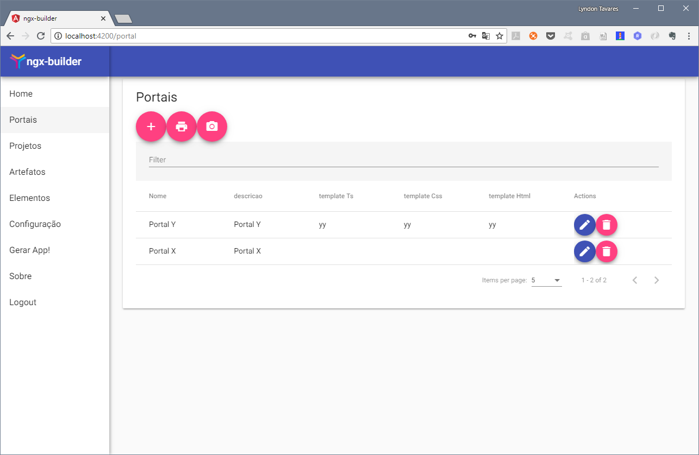
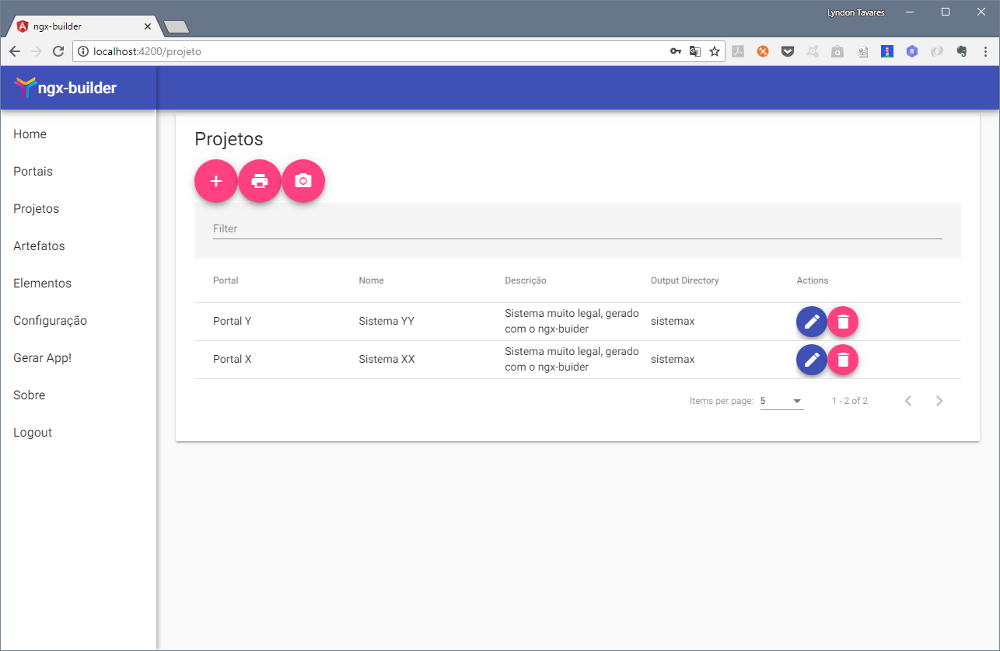
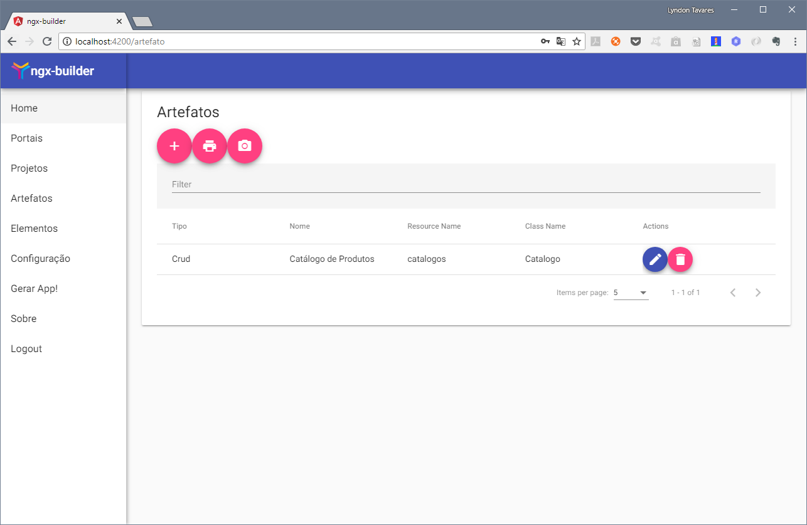
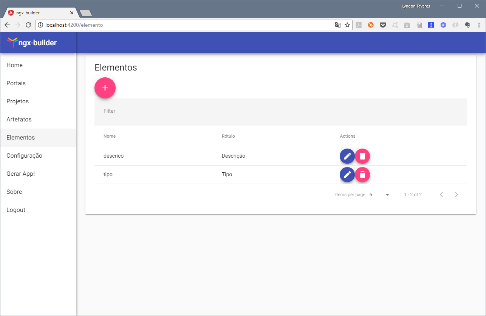
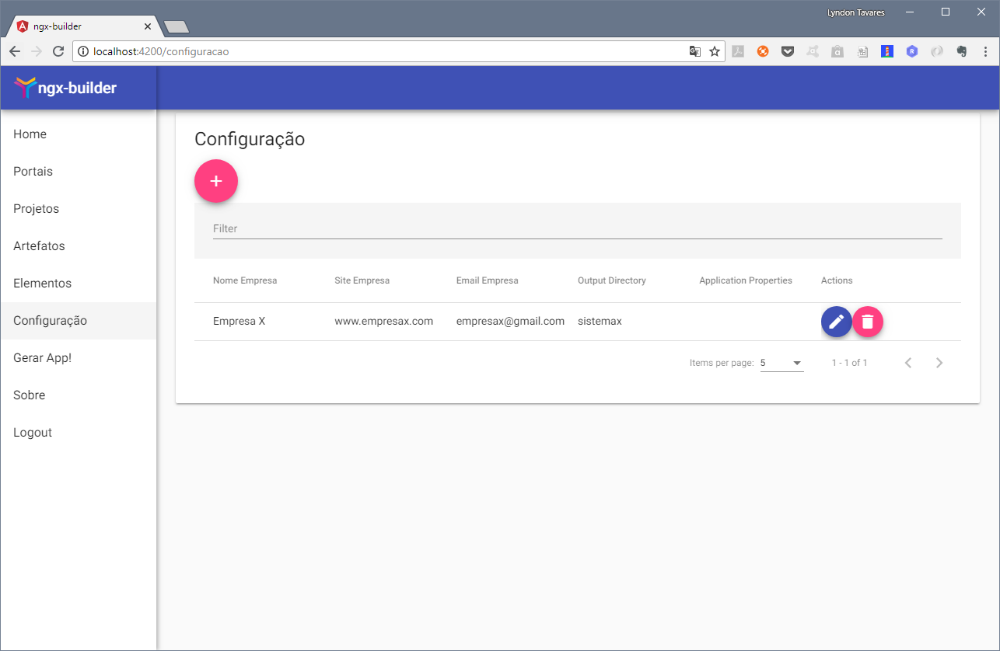
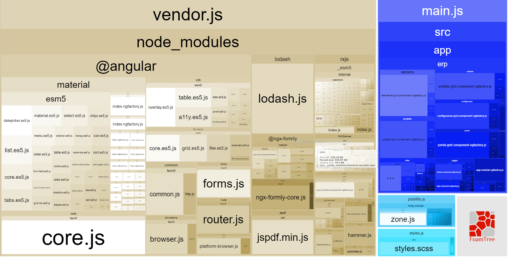

[![license] 

# NGX-Builder v 0.0.2

## ngx-builder

Construtor de aplicativos usando template engine FreeMaker, Spring Boot e Angular 6. 

## Pré-requisitos

* IDE Java Eclipse (http://www.eclipse.org/)
* Lombok (https://projectlombok.org/download)
* Visual Code (https://code.visualstudio.com/download)
* NodeJS (https://nodejs.org/en/download/)
* MySql (https://www.mysql.com/downloads/)

## Instalação

### Passo 1

Clone o repositório:
```
git clone https://github.com/integraldominio/ng-builder-api.git
```
### Passo 2

Importe o projeto Maven com IDE Java.

### Passo 3

Crie o database ngxbuilder no MySql. Configure usuário e senha nos profiles 

#### Selecione do profile

```
-Dspring.profiles.active=dev
-Dspring.profiles.active=prod
```

#### application-prod.properties:

```
spring.datasource.username=root
spring.datasource.password=1234
```

#### mysql command line:

```
mysql -uroot -p1234
create database ngxbuilder;
```

### Passo 4 

Prepare o profile de produção (applicaiton-pro.properties) em run configurations. IDE Eclipse.

### Passo 5

Gere o frontend do ngbuilder, executando GenerationBackendFrontend.java

### Passo 6 

Abrir projeto Angular em output/frontend usando Visualcode (sugestão).
Abrir terminal.
execute:

```
npm i
ng serve --o
```

Acesso: 
```
usuário: admin
senha: admin
```

## Frontend Ngx-Builder

Módulos:

### Login


### Dashboard


### Portal:



### Projeto:



### Artefato:



### Elemento:



### Configurações:



### Gerar App:


## Geração de código

Por trás do ngx-builder está o conceito de geração de código por template engine. O ngx-builder usa o Apache FreeMaker. Usando Spring Boot no backend e Angular no frontend. Também está previso o backend javascript.

## Diagrama de classes


## Backend - Spring Boot

* Spring Boot (https://spring.io/projects/spring-boot)

## Backend - Nestjs

O Nest é uma framework para criar aplicativos do lado do servidor Node.js eficientes e escaláveis . Usa JavaScript progressivo, é construído com o TypeScript (preserva a compatibilidade com JavaScript puro) e combina elementos de OOP (Programação Orientada a Objetos), FP (Programação Funcional) e FRP (Programação Reactiva Funcional).

Nest faz uso do Express, mas também oferece compatibilidade com uma ampla gama de outras bibliotecas, como por exemplo o Fastify, permitindo o uso fácil dos inúmeros plugins de terceiros disponíveis.

* nestjs (https://docs.nestjs.com/)
* typeorm (http://typeorm.io/#/)
* GraphQL (https://www.apollographql.com/)

### Iniciando com Nestjs


Usando CLI
```
npm i -g @nestjs/cli
nest new project-name
```

Usando seed
```
git clone https://github.com/nestjs/typescript-starter.git project
cd project
npm install
npm run start
```

Usando npm
```
npm i --save @nestjs/core @nestjs/common rxjs reflect-metadata
```

Main.js

```javascript
import { NestFactory } from '@nestjs/core';
import { ApplicationModule } from './app.module';

async function bootstrap() {
  const app = await NestFactory.create(ApplicationModule);
  await app.listen(3000);
}
bootstrap();
```

Iniciando
```
npm run start
```

#### Controllers
Os controllers são responsáveis ​​por manipular solicitações de entrada e retornar respostas para o cliente.


```javascript
cats.controller.ts

import { Controller, Get } from '@nestjs/common';

@Controller('cats')
export class CatsController {
  @Get()
  findAll() {
    return 'This action returns all cats';
  }
}
```

#### Decorators
No exemplo acima, usamos o @Controller('cats')decorador, que é necessário para definir um controlador básico. O catsé um prefixo opcional para cada rota registrada na classe. Usar um prefixo permite que você evite se repetir quando todas as suas rotas compartilharem um prefixo comum. O @Get()decorador próximo ao findAll() método informa ao Nest para criar um nó de extremidade para esse caminho de rota e mapear todas as solicitações correspondentes para esse manipulador. Como declaramos um prefixo para cada rota ( cats), o Nest /cats mapeará cada solicitação GET para esse método.

Quando uma solicitação GET é feita para esse terminal, o Nest retornará um código de status 200 e o JSON analisado , nesse caso apenas uma matriz vazia. Como isso é possível? Geralmente, distinguimos duas abordagens diferentes para manipular a resposta:

```
Padrão (recomendado): Quando retornarmos um objeto ou array JavaScript, ele será automaticamente analisado para JSON. Quando retornamos uma string, o Nest enviará apenas uma string sem tentar analisá-la. Além disso, o código de status da resposta é sempre 200 por padrão, exceto para solicitações POST, que usam 201 . Podemos facilmente alterar esse comportamento adicionando o @HttpCode(...)decorador em um nível de manipulador. 

Biblioteca específica: Podemos usar o objeto de resposta específico da biblioteca , que podemos injetar usando o @Res()decorador na assinatura da função, por exemplo findAll(@Res() response).

Aviso É proibido usar as duas abordagens ao mesmo tempo. O Nest detecta se o manipulador está usando um @Res()ou @Next(), se for esse o caso - a maneira padrão é desativada para essa rota única e não funcionará mais conforme o esperado.

```
#### Solicitar objeto

Muitos endpoints precisam de acesso aos detalhes da solicitação do cliente . Na verdade, o Nest está usando o objeto de solicitação específico da biblioteca (expresso por padrão) . Podemos forçar o Nest a injetar o objeto request no manipulador usando o @Req()decorador.

```javascript
cats.controller.ts

import { Controller, Get, Req } from '@nestjs/common';

@Controller('cats')
export class CatsController {
  @Get()
  findAll(@Req() request) {
    return 'This action returns all cats';
  }
}

```

## Frontend - Angular 6

* Angular (https://angular.io/)

### Analyzer

#### https://www.npmjs.com/package/webpack-bundle-analyzer

```
npm i webpack-bundle-analyzer
ng build --aot --stats-json
webpack-bundle-analyzer ./dist/ngmaterial2/stats.json
```




### Árvore projeto

```
app
│   angular.json
│   db.json
│   package.json
│   README.md
│   tsconfig.json
│   tslint.json
│
├───e2e
└───src
    │   browserslist
    │   favicon.ico
    │   index.html
    │   karma.conf.js
    │   main.ts
    │   polyfills.ts
    │   styles.scss
    │   test.ts
    │   tsconfig.app.json
    │   tsconfig.spec.json
    │   tslint.json
    │
    ├───app
    │   │   app-rotas.module.ts
    │   │   app.module.ts
    │   │
    │   ├───erp
    │   │   ├───artefato
    │   │   │       artefato-form.component.css
    │   │   │       artefato-form.component.html
    │   │   │       artefato-form.component.ts
    │   │   │       artefato-grid.component.css
    │   │   │       artefato-grid.component.html
    │   │   │       artefato-grid.component.ts
    │   │   │       artefato.service.ts
    │   │   │
    │   │   ├───buildapp
    │   │   │       buildapp.component.css
    │   │   │       buildapp.component.ts
    │   │   │
    │   │   ├───configuracao
    │   │   │       configuracao-form.component.css
    │   │   │       configuracao-form.component.html
    │   │   │       configuracao-form.component.ts
    │   │   │       configuracao-grid.component.css
    │   │   │       configuracao-grid.component.html
    │   │   │       configuracao-grid.component.ts
    │   │   │       configuracao.service.ts
    │   │   │
    │   │   ├───elemento
    │   │   │       elemento-form.component.css
    │   │   │       elemento-form.component.html
    │   │   │       elemento-form.component.ts
    │   │   │       elemento-grid.component.css
    │   │   │       elemento-grid.component.html
    │   │   │       elemento-grid.component.ts
    │   │   │       elemento.service.ts
    │   │   │
    │   │   ├───portal
    │   │   │       portal-form.component.css
    │   │   │       portal-form.component.html
    │   │   │       portal-form.component.ts
    │   │   │       portal-grid.component.css
    │   │   │       portal-grid.component.html
    │   │   │       portal-grid.component.ts
    │   │   │       portal.service.ts
    │   │   │
    │   │   └───projeto
    │   │           projeto-form.component.css
    │   │           projeto-form.component.html
    │   │           projeto-form.component.ts
    │   │           projeto-grid.component.css
    │   │           projeto-grid.component.html
    │   │           projeto-grid.component.ts
    │   │           projeto.service.ts
    │   │
    │   ├───infra
    │   │   ├───auth
    │   │   │       api.service.ts
    │   │   │       auth.service.ts
    │   │   │       index.ts
    │   │   │       user.service.ts
    │   │   │
    │   │   ├───comps
    │   │   │   ├───dashcard
    │   │   │   │       dashcard.component.html
    │   │   │   │       dashcard.component.scss
    │   │   │   │       dashcard.component.ts
    │   │   │   │
    │   │   │   └───file-upload
    │   │   │           file-upload.component.css
    │   │   │           file-upload.component.html
    │   │   │           file-upload.component.ts
    │   │   │
    │   │   ├───pipes
    │   │   │       MaxCharPipe.ts
    │   │   │
    │   │   ├───security
    │   │   │       admin.guard.ts
    │   │   │       auth.guard.ts
    │   │   │       authentication.service.ts
    │   │   │       config.service.ts
    │   │   │       guest.guard.ts
    │   │   │       index.ts
    │   │   │       jwt.interceptor.ts
    │   │   │       message.service.ts
    │   │   │       resource.service.ts
    │   │   │
    │   │   └───users
    │   │           user-form.component.css
    │   │           user-form.component.html
    │   │           user-form.component.ts
    │   │           user-grid.component.css
    │   │           user-grid.component.html
    │   │           user-grid.component.ts
    │   │           user-upload.component.html
    │   │           user-upload.component.ts
    │   │           users.service.ts
    │   │
    │   ├───pages
    │   │   ├───base
    │   │   │       base.component.html
    │   │   │       base.component.ts
    │   │   │
    │   │   ├───erro
    │   │   │       erro.component.css
    │   │   │       erro.component.html
    │   │   │       erro.component.ts
    │   │   │
    │   │   ├───home
    │   │   │       home.component.css
    │   │   │       home.component.html
    │   │   │       home.component.ts
    │   │   │
    │   │   ├───login
    │   │   │       login.component.html
    │   │   │       login.component.scss
    │   │   │       login.component.ts
    │   │   │
    │   │   ├───sidenav
    │   │   │       sidenav.component.css
    │   │   │       sidenav.component.html
    │   │   │       sidenav.component.ts
    │   │   │       sidenav.service.ts
    │   │   │
    │   │   └───sobre
    │   │           sobre.component.css
    │   │           sobre.component.html
    │   │           sobre.component.ts
    │   │
    │   └───shared
    │       │   material.module.ts
    │       │
    │       ├───autocomplete
    │       │       autocomplete-type.component.ts
    │       │
    │       ├───models
    │       │       display-message.ts
    │       │
    │       └───utilities
    │               loose-invalid.ts
    │               serialize.ts
    │
    ├───assets
    │   ├───icon
    │   │       auth.svg
    │   │       facebook.svg
    │   │       github-logo.svg
    │   │       github-plus.png
    │   │       google-plus.svg
    │   │
    │   ├───images
    │   │       face-7.jpg
    │   │       logo.svg
    │   │
    │   └───svg-loaders
    │           puff.svg
    │
    └───environments
            environment.prod.ts
            environment.ts
```


## Freemaker
https://freemarker.apache.org/

Tecnologias:

### Angular 6

- [x] Angular as the application framework- 
- [x] Angular Material as the UI language and component library
- [ ] Angular Firebase for easy user authentication
- [x] Angular Flex Layout for dynamic responsive layouts
- [x] Fully typed build tools and application using TypeScript
- [x] Manage your type definitions using @types (easier than using typings)
- [ ] Automatic sitemap generation
- [x] SCSS support for professional grade CSS management
- [ ] Full favicon icon generation for multiple devices derived from a single seed image
- [ ] Analyze bundle sizes by using source-map-explorer
- [ ] Cookies Support
- [ ] Simple Ad-Blocker detection service
- [ ] Built by Angular Universal Consulting

### Springboot

# License
```
MIT License

Copyright (c) 2018, Lyndon Tavares (integraldominio@gmail.com)

Permission is hereby granted, free of charge, to any person obtaining a copy
of this software and associated documentation files (the "Software"), to deal
in the Software without restriction, including without limitation the rights
to use, copy, modify, merge, publish, distribute, sublicense, and/or sell
copies of the Software, and to permit persons to whom the Software is
furnished to do so, subject to the following conditions:

The above copyright notice and this permission notice shall be included in all
copies or substantial portions of the Software.

THE SOFTWARE IS PROVIDED "AS IS", WITHOUT WARRANTY OF ANY KIND, EXPRESS OR
IMPLIED, INCLUDING BUT NOT LIMITED TO THE WARRANTIES OF MERCHANTABILITY,
FITNESS FOR A PARTICULAR PURPOSE AND NONINFRINGEMENT. IN NO EVENT SHALL THE
AUTHORS OR COPYRIGHT HOLDERS BE LIABLE FOR ANY CLAIM, DAMAGES OR OTHER
LIABILITY, WHETHER IN AN ACTION OF CONTRACT, TORT OR OTHERWISE, ARISING FROM,
OUT OF OR IN CONNECTION WITH THE SOFTWARE OR THE USE OR OTHER DEALINGS IN THE
SOFTWARE.
```

